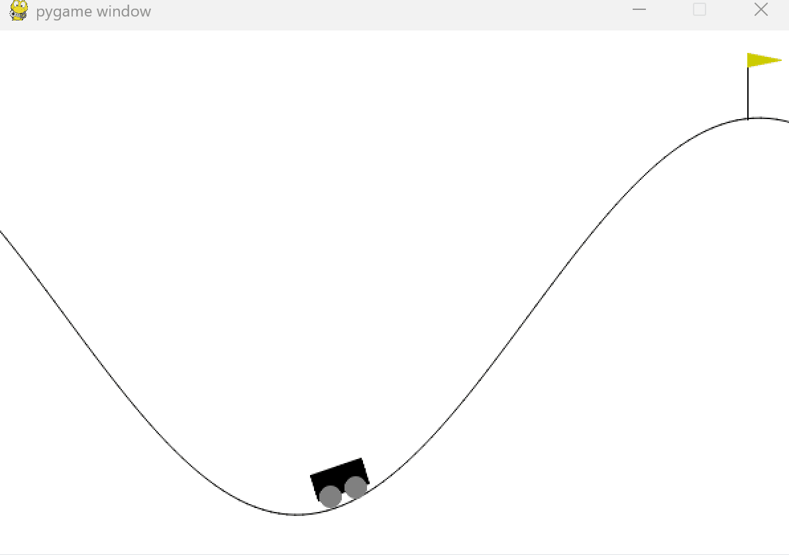
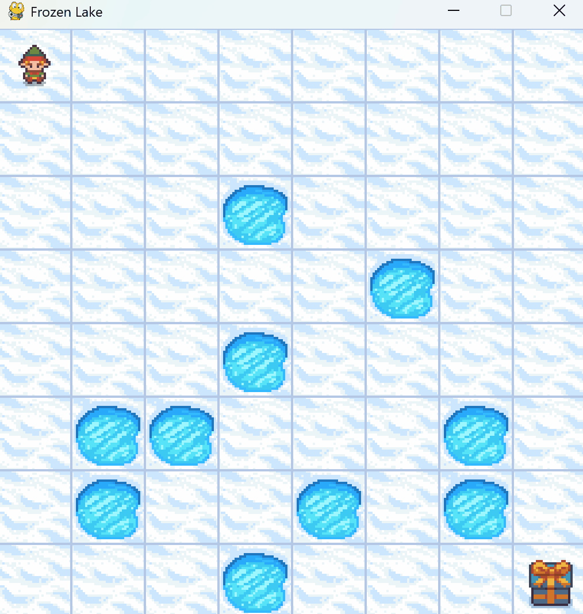

# OOP - Group Project (9)

## 👥 Group Members
| Name     | Student ID   | Class |
|--------- |------------- |-------|
| **劉育希**   | B123040049   | 中文班 `CSE391`  |
| **侯廷翰**   | B123040044   | 中文班 `CSE391`  |
| **柯伯諺**   | B123245016   | 全英班 `CSE3002` |


## 📄 Project Content

### 🏔️ Part 1: Mountain Car
- **Content**:  
    Train a reinforcement learning agent using **Q-Learning** to solve the `MountainCar-v0` environment.

- **Purpose**:  
    To Test if the *Gymnasim* environment packages is **working properly**.



### 🧊 Part 2: Frozen Lake
- **Algorithm**:  
    **Q-Learning** on the `FrozenLake-v1` environment (8x8 map, slippery).

- **Hyperparameter Tuning**:   
    Uses **Optuna** to find the best combination of:
    - `epsilon_decay_rate`
    - `min_epsilon`
    - `learning_rate`

- **Features**:
    - **Modes**: Train (`--train`), Run (`--run`), and Tune (`--tune`).
    - **Metrics**: Calculates and displays the success rate of the agent.

- **Results**:  
    Achieved a success rate of **55% ~ 60%** (In `500` episodes) after training for **15000 episodes** with the best hyperparameters.



### 🏎️ Part 3: Car Racing
- **Custom Environment**: `CustomCarRacing` inherits from `gymnasium.CarRacing`.
    - **Multi-Agent**: Adds a second car (NPC/Opponent) to the track.
    - **Visuals**: Implements a new theme and a mini-map.

- **OOP Design**: [UML Graph](./UML.svg)
    - **Abstraction**: `Agent` abstract base class defines the interface.
    - **Polymorphism**: Multiple agent implementations (`ManualAgent`, `RandomAgent`, `HeuristicAgent`, `SmartAgent`).
    - **Encapsulation**: `Trainer` class manages the game loop and rendering.

- **Agents**:
    - **Manual Agent**: Keyboard control with a boost mechanic (Spacebar).
    - **Random Agent**: Random action selection for NPCs.
    - **Smart Agent**: CNN-based reinforcement learning agent.


## 🚀 Running the Project

### 🛠️ Installation Manual [🔗](./Installation.md) 
To run this project, please follow the [Installation Manual](./Installation.md) to set up the necessary environment and dependencies.

### 🏔️ Part 1: Mountain Car
Train and test the reinforcement learning agent:

```bash
# Train the agent
python mountain_car.py --train --episodes 5000

# Render and visualize performance
python mountain_car.py --render --episodes 10
```

### 🧊 Part 2: Frozen Lake
Run the Frozen Lake environment:

```bash
# You can choose one of the following modes:
python frozen_lake.py [--train | --run | --tune]
```

### 🏎️ Part 3: Car Racing
Execute our custom Car Racing environment:

```bash
python main.py
```

## 🤝 Contribution
| Name     | Part 1 | Part 2 | Part 3 | Others |
|:--------:|:-------|:-------|:-------|:---------------------|
| **劉育希** |  Done ✅  | Optuna | Readme & OOP Design | Slides & Reflection Report |
| **侯廷翰** |  Done ✅  | Greedy Search | Reinforcement Learning Part | Reflection Report |
| **柯伯諺** |  Done ✅  | Optuna | OOP Structure Implementation | UML Diagram & Slides |
